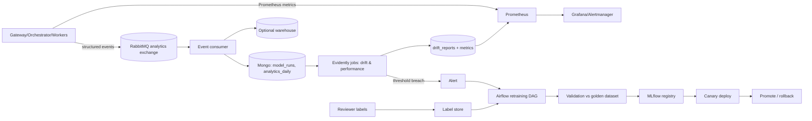

# Data Analysis Pipeline

Operational pipeline that turns runtime events into metrics, drift signals, and retraining. Metric definitions: `Data analysis and design.md`.

## 1. Overview

## 2. Stages
### 2.1 Collection
- **Metrics (pull):** Prometheus scrapes service `/metrics` (queue depth via RabbitMQ exporter, task latency histograms, case outcomes).
- **Events (push):** services publish to a dedicated `analytics` exchange (non-blocking, lossy-tolerant, separate from the critical task queues).
- **Inference stats:** each worker writes feature statistics (blur, glare, brightness, resolution, doc type, score) to `model_runs`. No raw images.

### 2.2 Validation
Great Expectations suites on `model_runs`/events: schema, nulls, ranges, allowed enums, volume anomalies. Failures page the data owner and quarantine the batch.

### 2.3 Transformation
- Streaming consumer → idempotent upserts into `analytics_daily` (by `date, region, docType, stage`).
- Nightly batch (Airflow): compute funnels, SLO reports, cohort slices, fairness tables, k-anonymity suppression.
- Optional export to a warehouse for long-range analysis.

### 2.3.1 Joining labels
Reviewer decisions and delayed outcomes join on pseudonymized `caseId` → `labels` table (`caseId, trueOutcome, source, labeledAt`).

## 3. Drift & performance monitoring
| Signal | What | Method | Cadence |
|---|---|---|---|
| Data drift | Input stats (blur, glare, brightness, resolution, doc-type mix, device mix) vs reference window | **PSI**, **KS test**, Evidently reports | hourly/daily |
| Prediction drift | Distribution of OCR confidences, face distances, liveness scores, decision mix | PSI/KS/Jensen-Shannon | daily |
| Performance | CER/WER, FMR/FNMR, APCER/BPCER on labeled data | Evidently + custom metrics | weekly / when labels arrive |
| Fairness | Metrics by slice | gap thresholds | monthly |
Reference window = frozen training/golden distribution (DVC-versioned). Alert policy: warn → investigate → critical (triggers retraining proposal). Use persistence (e.g., N consecutive windows) to avoid alert fatigue.

## 4. Retraining pipeline (Airflow DAG)
1. **Trigger:** critical drift/performance alert, scheduled cadence, or manual.
2. **Fetch data:** versioned dataset (DVC) + new labeled samples (lawful basis/consent confirmed; PII-minimized).
3. **Validate data:** Great Expectations.
4. **Train / fine-tune:** containerized job (GPU pool job) with tracked params (MLflow).
5. **Evaluate on golden dataset:** gates (see `AI-ML MODEL integration.md`).
6. **Register:** MLflow model registry → `Staging`.
7. **Approval:** ML lead + (for face/liveness) security/compliance sign-off.
8. **Canary:** route small % of traffic via orchestrator `model_version` routing; compare live metrics.
9. **Promote or rollback;** record lineage (code commit, data version, metrics).
Feature consistency (training vs serving): shared preprocessing library (same OpenCV code) or Feast if a feature store is introduced.

## 5. Jobs & schedules
| Job | Engine | Schedule |
|---|---|---|
| Metrics scrape | Prometheus | 15 s |
| Event consumer | K8s Deployment | continuous |
| Data quality suite | Airflow | per batch |
| Drift report | Evidently (Airflow/CronJob) | hourly/daily |
| KPI rollup | Airflow | nightly |
| Fairness report | Airflow | monthly |
| Retention/erasure sweep | CronJob | nightly |
| Retraining DAG | Airflow | trigger/quarterly |

## 6. Alerts
Queue depth > threshold for N min; time-to-decision SLO burn; DLQ non-empty; model drift critical; FMR/FNMR breach; unusual PII-reveal volume; data-quality failure; erasure SLA at risk.

## 7. Data governance for the pipeline
- No raw biometrics in analytics stores.
- Training data from production requires documented lawful basis and consent scope; otherwise use opt-in or synthetic/licensed data.
- Dataset and model lineage stored for audits; deletion requests propagate to training sets where feasible (document policy, e.g., excluded from next retrain).

## 8. CI integration
Pull requests that touch ML code run: unit tests, data-schema tests, **behavioral tests** on a small golden slice, and block merge on metric regression beyond tolerance. Full golden evaluation runs nightly and before promotion.
