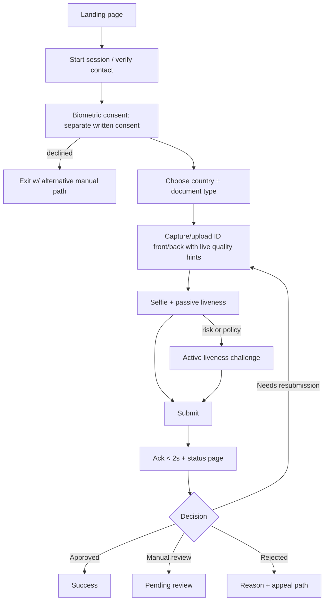

# Detailed Workflow

Two parts: **(A)** the Spiral Model delivery plan, **(B)** the runtime KYC workflows.

---
# PART A — Spiral Model Delivery Plan

## A.1 Why Spiral
KYC touches regulation, biometrics, ML accuracy, and scale: all high-uncertainty. Spiral front-loads **risk analysis** every cycle and produces a working prototype each loop, so legal, security, and accuracy risks are discovered early instead of at release.

## A.2 Each spiral = 4 quadrants
```
        2. Risk analysis & prototyping
                 │
 1. Determine ───┼─── 3. Develop & verify
 objectives      │
                 │
        4. Review & plan next spiral
```
| Quadrant | Activities | Output |
|---|---|---|
| 1 Objectives | Define goals, constraints, alternatives | Spiral charter |
| 2 Risk | Identify/rank risks, prototype or spike to retire the top ones | Risk register update |
| 3 Develop & test | Build increment, test, validate | Working increment + test report |
| 4 Review/plan | Stakeholder review, go/no-go, plan next | Retrospective + next charter |

## A.3 Spiral roadmap

### Spiral 0 — Concept & Feasibility (Weeks 1-3)
- **Objectives:** confirm scope, jurisdictions, document types, success metrics.
- **Risks:** legal (consent/BIPA), licensing, data availability for golden dataset.
- **Develop:** legal memo, license audit, architecture spike, clickable prototype, risk register, threat-model v0.
- **Exit:** approved PRD, jurisdictions list, compliance baseline (adopt BIPA-style written consent as global floor).

### Spiral 1 — Core Pipeline Prototype (Months 1-3) *(report Phase 1)*
- **Objectives:** end-to-end happy path: upload → OCR → face match → decision.
- **Risks:** OCR accuracy on real IDs, WebRTC compatibility, queue design.
- **Develop:**
  1. K8s cluster with node pools (app / db / ai-workers); MongoDB 3-node replica set; S3/MinIO; RabbitMQ with quorum queues.
  2. React capture UI (document + selfie), Node/Express upload gateway, FastAPI orchestrator.
  3. PaddleOCR + DeepFace workers; OpenCV pre-processing.
  4. Basic consent screen, TLS, encryption at rest.
- **Test:** unit + integration; 50-100 synthetic IDs; measure CER/WER and match scores.
- **Exit criteria:** happy-path demo; first accuracy baseline; top-5 risks re-ranked.

### Spiral 2 — Secure, Compliant MVP (Months 3-5)
- **Objectives:** safe to pilot with limited real users.
- **Risks:** consent defects, PII leakage, weak access control.
- **Develop:** granular consent ledger; Vault/KMS envelope encryption; OIDC login; RBAC; audit log v1; reviewer dashboard v1; retention config; erasure workflow; passive liveness v1; resubmission flow.
- **Test:** security review, DPIA, pen-test lite, consent evidence audit.
- **Exit:** legal + security sign-off for pilot; DPIA approved.

### Spiral 3 — Scale & Performance (Months 4-6) *(report Phase 2)*
- **Objectives:** meet latency/throughput targets.
- **Risks:** queue backlog, DB hot spots, cold-start latency, resource limits/OOM.
- **Develop:** KEDA ScaledObjects on queue depth; resource requests=limits for guaranteed QoS; liveness/readiness probe separation; RabbitMQ prefetch tuning, 3-replica + anti-affinity + PDB, fast storage (5k-20k IOPS); Mongo ESR-based indexes verified via `explain()`; TTL indexes; Prometheus/Grafana SLO dashboards; load tests.
- **Exit:** target P95 latency under load; no data loss in node-kill chaos test.

### Spiral 4 — Advanced Fraud Defense & Hardening (Months 7-9) *(report Phase 3)*
- **Objectives:** resist sophisticated attacks; production readiness.
- **Risks:** deepfakes, injection attacks, insider threat, DR gaps.
- **Develop:** active liveness challenges; tamper detection (ELA/FFT); NetworkPolicies; field-level RBAC; external KMS rotation; SIEM shipping; DR plan with MongoDB/RabbitMQ backups and restore drills; UX polish; model validation gates in CI.
- **Exit:** red-team report closed; DR drill passed; production go-live checklist.

### Spiral 5+ — MLOps & Continuous Improvement (Ongoing) *(report Phase 4)*
- **Objectives:** sustain accuracy as data shifts.
- **Risks:** silent model drift (studies cited in the report found 91% of model/dataset pairs degrade over time), bias, alert fatigue.
- **Develop:** Evidently drift monitoring; PSI/KS tests; Airflow retraining DAG; MLflow registry; canary rollout; fairness slices; false-positive/negative review loop.
- **Cycle:** each quarter = one mini-spiral (new doc types, new jurisdictions, new models).

## A.4 Risk register template (maintained every spiral)
| ID | Risk | Likelihood | Impact | Exposure | Mitigation/prototype | Owner | Status |
|---|---|---|---|---|---|---|---|

## A.5 Governance
- **Go/no-go gates** at the end of Quadrant 4, with product, security, legal, ML signatures.
- **Definition of Done** (per increment): code reviewed; tests green; security scan clean; docs updated; metrics instrumented; model gates passed (if ML touched).

---
# PART B — Runtime KYC Workflows

## B.1 Applicant journey


## B.2 Case state machine
`CREATED → CONSENTED → DOCS_UPLOADED → QUEUED → PROCESSING → {AUTO_APPROVED | MANUAL_REVIEW | AUTO_REJECTED | NEEDS_RESUBMISSION} → {APPROVED | REJECTED} → ARCHIVED → ERASED`
- Transitions are performed only by the orchestrator (or reviewers via API) and each writes an audit event.
- Failure states: `PROCESSING_FAILED` (retry with backoff → dead-letter queue → manual ops).

## B.3 Processing pipeline (per case)
1. Gateway streams files to S3 (SSE-KMS), writes case + artifact refs to MongoDB, publishes `kyc.case.created` to RabbitMQ.
2. Orchestrator consumes, sets `PROCESSING`, fans out tasks:
   - **Preprocess (OpenCV):** deskew, glare suppression, contrast normalization, denoise; image-quality score.
   - **OCR (PaddleOCR):** text + layout → structured JSON; MRZ parse/checksum.
   - **Doc validation:** expiry, format, field consistency, template match.
   - **Tamper:** ELA, FFT spectral, metadata/EXIF heuristics.
   - **Face:** detect/align, extract ID-photo face, embed selfie + ID face (DeepFace), compute distance vs. model threshold.
   - **Liveness:** passive score; active result if challenged.
3. Results written to the case document (embedded) and S3 evidence (heatmaps, crops).
4. **Decision engine** applies rules (per jurisdiction/risk tier):
   - All checks above auto-approve thresholds → `AUTO_APPROVED`
   - Any hard-fail (tamper high, liveness fail, expired doc) → `AUTO_REJECTED` or `NEEDS_RESUBMISSION` (if quality-related)
   - Gray zone → `MANUAL_REVIEW` with flags and priority.
5. Notification to applicant; metrics + events emitted.

## B.4 Manual review workflow
Queue (priority by SLA + risk) → reviewer claims case (lock with TTL) → views masked PII, evidence → decision + reason code → if override of an auto-signal, requires second reviewer (four-eyes) → audit + feedback label stored for retraining (with consent/lawful basis).

## B.5 Data subject request workflow
Request received (≥2 channels) → identity check → compliance officer queue → execute: export (access), correct, or erase (S3 objects, Mongo docs, derived embeddings, caches; backups follow documented expiry) → certificate generated → audit log (retained as legally required).

## B.6 Model lifecycle workflow
Data drift/performance alert → Airflow retraining DAG → DVC-versioned data → train → evaluate on golden dataset (CER/WER, FMR@1e-5, FNMR, liveness APCER/BPCER, fairness slices) → register in MLflow (Staging) → approval gate → canary (small traffic %) → monitor → promote or rollback.

## B.7 Operational workflows
- **Incident:** alert → on-call → runbook → post-mortem feed into next spiral risk register.
- **Release:** MR → CI (lint, tests, SAST, deps scan, model gates) → staging → approval → Argo CD sync → canary → full.
- **Key rotation:** Vault rotates KEK on schedule; DEKs re-wrapped; audit event.
