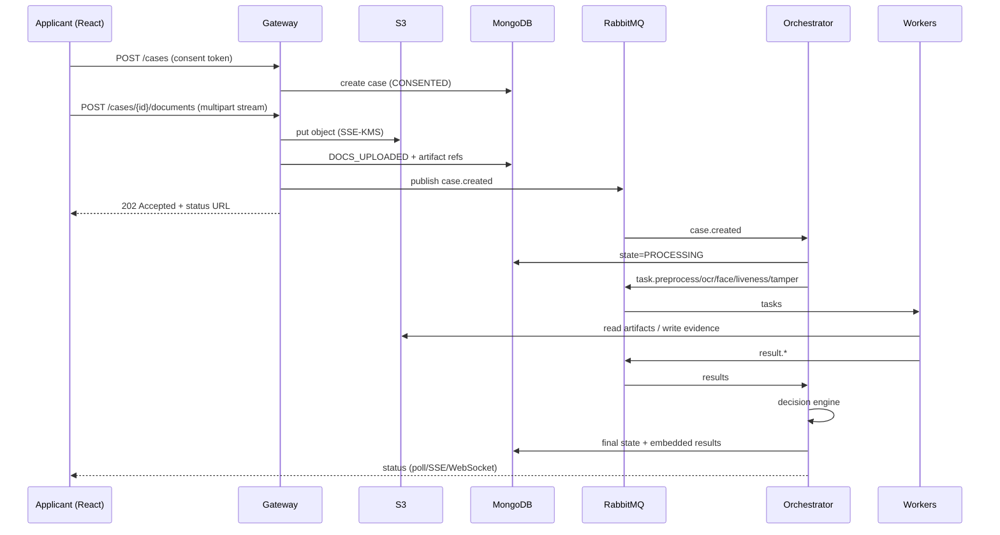

# System Architecture (Component Specification)

## 1. Component catalogue
| Component | Tech | Responsibilities | Scales on |
|---|---|---|---|
| `web` | React SPA | Onboarding flow, capture, status | CDN/static |
| `dashboard` | React SPA | Reviewer, compliance/admin, MLOps UIs | static |
| `gateway` | Node/Express | AuthN (OIDC), consent API, upload streaming to S3, WebRTC signaling, case CRUD (BFF), rate-limiting, publishing tasks | CPU/RPS |
| `orchestrator` | FastAPI | Case state machine, task fan-out/fan-in, decision engine, rule config, model-version routing | in-flight cases |
| `worker-preprocess` | Python + OpenCV | Quality score, deskew, glare, denoise | queue depth |
| `worker-ocr` | Python + PaddleOCR | OCR, layout, field extraction, MRZ | queue depth |
| `worker-face` | Python + DeepFace | Detect/align/embed/verify | queue depth |
| `worker-liveness` | Python | Passive/active liveness scoring | queue depth |
| `worker-tamper` | Python + OpenCV | ELA, FFT, metadata checks | queue depth |
| `audit-service` | Node or Python | Append-only audit events, hash chaining, SIEM forwarder | throughput |
| `retention-service` | Python CronJob | TTL enforcement, erasure execution, certificates | schedule |
| `notification-service` | Node | Email/SMS/webhook | queue depth |
| `ml-platform` | MLflow, Airflow, Evidently | Registry, drift, retraining | n/a |

## 2. Primary sequence — submission to decision

## 3. WebRTC capture path
1. Browser `getUserMedia` → local preview with real-time quality hints (client-side lightweight checks).
2. Signaling via Gateway (WebSocket). ICE servers: STUN + **TURN over TCP 443** fallback.
3. Prefer H.264 on Safari/iOS; server transcodes if needed.
4. For MVP, capture short clip/frames on client, upload via HTTPS (simplest, most robust); full media-server streaming is optional later.
5. Active liveness: server issues random challenge sequence (e.g. turn left/right, blink) with nonce + expiry; client records; liveness worker verifies challenge compliance and anti-replay.

## 4. API surface (v1, representative)
### Applicant (via gateway)
| Method | Path | Purpose |
|---|---|---|
| POST | `/v1/sessions` | Start session |
| POST | `/v1/consents` | Record consent (type, version, text hash) |
| DELETE | `/v1/consents/{id}` | Withdraw consent |
| POST | `/v1/cases` | Create case |
| POST | `/v1/cases/{id}/documents` | Upload ID front/back (multipart) |
| POST | `/v1/cases/{id}/selfie` | Upload selfie/liveness media |
| GET | `/v1/cases/{id}/liveness-challenge` | Get active challenge |
| GET | `/v1/cases/{id}/status` | Status (SSE variant `/events`) |
| POST | `/v1/dsar` | Access/erasure request |

### Staff (dashboard)
| Method | Path | Purpose |
|---|---|---|
| GET | `/v1/review/queue` | Prioritized queue |
| POST | `/v1/review/{id}/claim` | Lock case |
| POST | `/v1/review/{id}/decision` | Approve/reject/resubmit + reason code |
| POST | `/v1/review/{id}/reveal` | Reveal masked field (audited) |
| GET/PUT | `/v1/admin/policies` | Thresholds, retention |
| GET | `/v1/audit` | Query audit log |
| GET | `/v1/ml/models`, `/v1/ml/drift` | MLOps views |

### Internal (orchestrator, mTLS only)
`POST /internal/cases/{id}/start`, `POST /internal/tasks/{id}/result`, `GET /internal/models/active`.

**Conventions:** JSON, OpenAPI-documented, idempotency keys on POST, problem+json errors, rate limits per IP/session, request IDs propagated for tracing.

## 5. Decision engine
- Inputs: OCR field confidences, doc validation flags, face distance (relative to model threshold), liveness score(s), tamper score, image quality, risk tier, jurisdiction policy.
- Rule set stored as versioned config (Mongo `policies`), evaluated deterministically; every decision stores `policyVersion`, `modelVersions`, and `reasonCodes` for explainability.
- Outputs: state + reason codes + review priority.
- Initial thresholds are **placeholders**; calibrate on golden dataset to hit FMR target and acceptable FNMR.

## 6. Failure handling
| Failure | Handling |
|---|---|
| Worker crash mid-task | Unacked message redelivered; idempotent task |
| Poison message | Retry w/ backoff → DLQ → alert |
| Broker node loss | Quorum queue leader election; PDB protects maintenance |
| DB primary loss | Replica set election; drivers retry writes |
| Model load failure | Readiness fails; pod not served; alert |
| Slow external dependency | Readiness removes pod; liveness unaffected |

## 7. Observability
- **Metrics:** queue depth, consumer lag, task latency per stage, case time-to-decision histogram, STP rate, error rates, model scores distribution, DB op latency.
- **Logs:** structured JSON (no PII; use case IDs), shipped to Loki; audit events separate.
- **Traces:** OpenTelemetry across gateway → orchestrator → workers.
- **SLOs:** upload ack, time-to-decision, availability; alert on burn rate.

## 8. Configuration & secrets
Config via ConfigMaps (non-sensitive) and Vault (sensitive). Feature flags for thresholds and active-liveness policy. Environment parity through Helm values.
