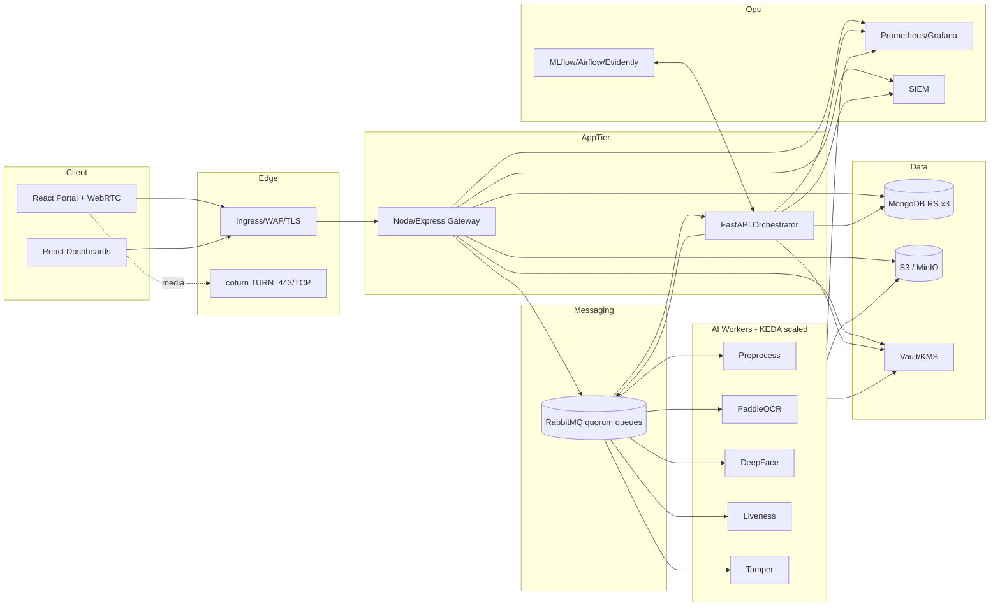

# Architecture

High-level architecture, principles, deployment topology, scaling and key decisions. Component-level detail is in `System architecture.md`.

## 1. Principles
1. **Asynchronous by default:** web tier acknowledges fast; AI work happens off the request path.
2. **Separation of concerns:** I/O (Node), orchestration (FastAPI), compute (workers), state (MongoDB), blobs (S3).
3. **Compliance as architecture constraint:** consent, encryption, residency, retention, audit are first-class components.
4. **Independent scaling:** every tier scales on its own signal.
5. **Immutable, declarative infra:** containers, Helm/Kustomize, GitOps.
6. **Design for ML decay:** monitoring and retraining are part of the system, not an afterthought.

## 2. Logical view

## 3. Deployment topology (Kubernetes)
| Namespace | Contents | Node pool |
|---|---|---|
| `edge` | Ingress controller, WAF, coturn | app |
| `kyc-app` | web (static/NGINX), dashboard, gateway, orchestrator | app |
| `kyc-ai` | worker deployments (preprocess, ocr, face, liveness, tamper) | ai-workers (CPU; GPU optional) |
| `kyc-data` | MongoDB (Operator), RabbitMQ (Operators), MinIO if self-hosted | db (fast SSD) |
| `security` | Vault, Keycloak, policy engine (Kyverno/OPA) | app |
| `observability` | Prometheus, Grafana, Loki, Alertmanager | app |
| `mlops` | MLflow, Airflow, Evidently collector | app |

**Hardening:** default-deny NetworkPolicies; DB tier accepts connections only from app tier; Pod Security Standards "restricted"; image signing (cosign); read-only root FS; secrets from Vault (CSI/agent), never in env files in Git.

## 4. Scaling design
| Component | Signal | Mechanism |
|---|---|---|
| Web/Gateway | CPU/RPS | HPA |
| AI workers | RabbitMQ queue depth | **KEDA** ScaledObject (RabbitMQ trigger), `minReplicaCount` 0 off-peak or ≥1 if cold-start breaks SLO |
| Orchestrator | CPU/in-flight cases | HPA |
| RabbitMQ | disk IOPS, memory | 3 replicas, anti-affinity, PDB, fast block storage (5k-20k IOPS) |
| MongoDB | ops/s, working set | Replica set; shard on high-cardinality key (e.g. `caseId`/hashed `userId`) only when needed |

**Resource policy:** every container has CPU/memory requests = limits for production-critical pods (Guaranteed QoS). Beware CPU throttling and OOM kills; size model workers for peak model memory.

**Probe policy:** *liveness* = internal process health only; *readiness* = dependency checks (DB, broker). Never tie liveness to external dependencies (prevents restart storms).

## 5. Messaging topology
| Exchange | Type | Queues | Notes |
|---|---|---|---|
| `kyc.cases` | topic | `case.created`, `case.resubmitted` | Orchestrator consumes |
| `kyc.tasks` | direct | `task.preprocess`, `task.ocr`, `task.face`, `task.liveness`, `task.tamper` | Workers consume; prefetch tuned by task duration (start at 1 for long tasks) |
| `kyc.results` | topic | `result.*` | Orchestrator aggregates |
| `kyc.dlx` | fanout | `dead-letter` | Failed after N retries → ops alert |
- Quorum queues everywhere durable; manual acks; publisher confirms; idempotency key = `caseId + taskType + attempt`.
- Topology defined declaratively via RabbitMQ Messaging Topology Operator CRDs (GitOps).

## 6. Data flow & storage rules
- Raw artifacts → S3 only (SSE-KMS, per-case prefix, object lock for evidence where required).
- Case metadata, OCR fields, scores → MongoDB (embedded in the case doc).
- Unbounded history (verifications over time, audit) → separate collections referencing `userId`.
- Region pinning: one stack per residency region; no cross-region replication of PII without legal basis.

## 7. Resilience & DR
- RPO/RTO targets set in Spiral 4 (suggested starting: RPO ≤ 15 min, RTO ≤ 1 h; confirm with business).
- Mongo backups (snapshots + oplog), S3 versioning/replication within region, RabbitMQ definitions in Git (messages are transient; case state is in Mongo and recoverable by re-enqueue).
- Chaos tests: kill worker, broker node, DB primary; verify no lost cases.

## 8. Architecture Decision Records (summary)
| ADR | Decision | Status |
|---|---|---|
| 001 | Async queue between gateway and AI workers | Accepted |
| 002 | Node for I/O, FastAPI for AI orchestration | Accepted |
| 003 | Quorum queues over classic mirrored | Accepted |
| 004 | Embed OCR+scores in case document | Accepted |
| 005 | KEDA for worker autoscaling | Accepted |
| 006 | External KMS/Vault for keys | Accepted |
| 007 | CPU first, GPU pool when SLO requires | Proposed (validate in Spiral 3) |
| 008 | Separate liveness model from DeepFace if benchmark demands | Proposed (Spiral 1-2) |
